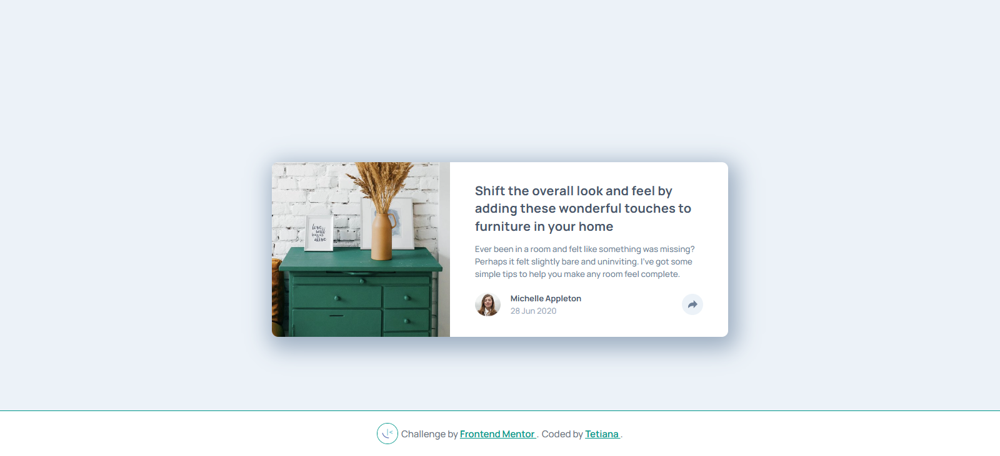

# Frontend Mentor - Article Preview Component

This is a solution to the [Article зreview сomponent challenge on Frontend Mentor](https://www.frontendmentor.io/challenges/article-preview-component-dYBN_pYFT).

## 📸 Screenshot

## 🔗 Links

- [Solution on Frontend Mentor]()
- [Live Site on Vercel](https://fem-projects-hub.vercel.app/article-preview-component)

## 🛠️ Built With

- HTML5 + Angular
- SCSS (BEM methodology)
- Responsive Design
- CSS Animations
- TypeScript

## 📚 What I Learned

- How to dynamically show/hide elements in Angular using `*ngIf` and `ngClass`
- Applying responsive design techniques with SCSS and `em` units
- Creating animated dropdowns with `opacity` and `transform` transitions
- Using SVGs with `currentColor` and CSS-based theming

## 👩‍💻 Author

- Frontend Mentor – [@TetianaAleks](https://www.frontendmentor.io/profile/TetianaAleks)
- GitHub – [@TetianaAleks](https://github.com/TetianaAleks)
- Portfolio – [https://tetiana-dev.vercel.app](https://tetiana-dev.vercel.app)

## 🙏 Acknowledgments

Thanks to the Frontend Mentor community for sharing helpful feedback and guidance!
