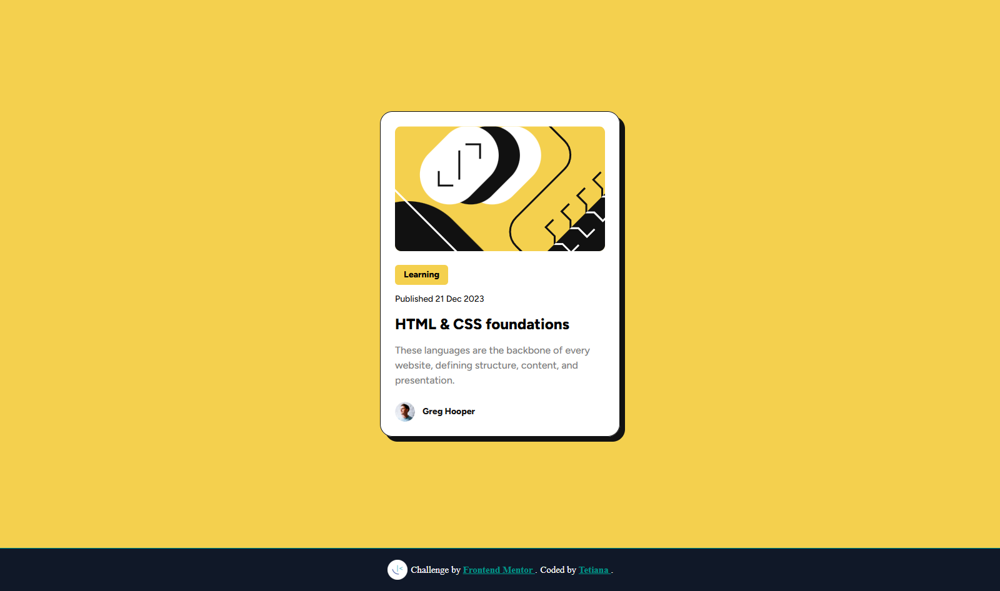

# 📦 Frontend Mentor - Blog Preview Card Solution

This is my solution to the [Blog preview card challenge on Frontend Mentor](https://www.frontendmentor.io/challenges/blog-preview-card-ckPaj01IcS).  
Frontend Mentor challenges help you improve your front-end skills by building real-world projects using professional design files.

---

## 📸 Screenshot



---

## 🔗 Links

- [Solution on Frontend Mentor](https://www.frontendmentor.io/solutions/responsive-blog-preview-card-using-html-css-clamp-and-local-fonts-NlR1mhHfNW)
- [Live Site on Vercel](https://fem-projects-hub.vercel.app/blog-preview-card)

---

## 🚀 My Process

### Built with

- Semantic HTML5 markup
- Modern CSS (Flexbox, clamp, box-shadow)
- Mobile-first responsive layout
- Custom font (Figtree) via local `@font-face`
- Accessibility and semantic tags (`<main>`, `<article>`, `<footer>`)

### What I learned

- How to implement responsive typography using `clamp()` instead of media queries
- Structuring semantic HTML for accessibility
- Matching precise spacing and styles from Figma designs
- Using local fonts via `@font-face`

```css
.card__title {
  font-size: clamp(1.25rem, 2.5vw, 1.5rem);
}
```

### Continued development

- Improving fluid layout with CSS Grid
- Refining accessibility and contrast ratios
- Using `rem` and `em` units consistently

---

## 👩‍💻 Author

- Website – [tetiana-dev.vercel.app](https://tetiana-dev.vercel.app)
- Frontend Mentor – [@TetianaAleks](https://www.frontendmentor.io/profile/TetianaAleks)
- GitHub – [@TetianaAleks](https://github.com/TetianaAleks)

---

## 🙌 Acknowledgments

Thanks to Frontend Mentor for high-quality challenges that help sharpen real-world development skills.