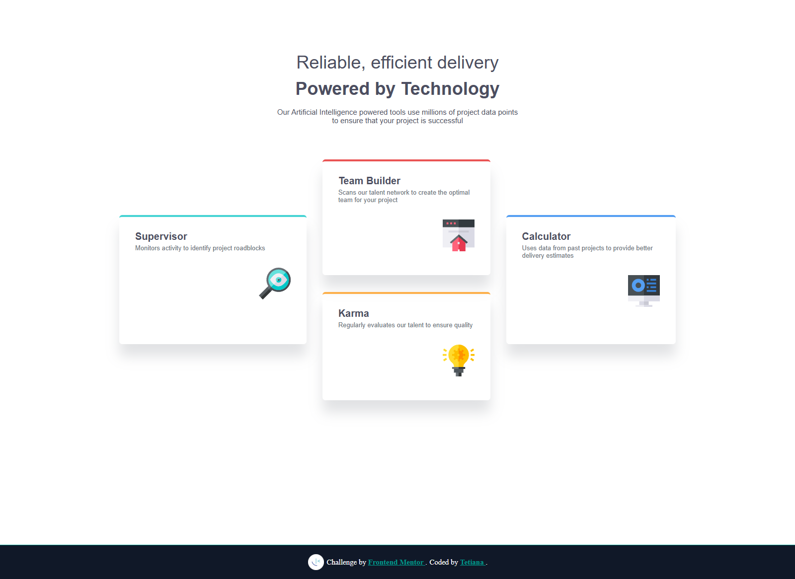

# Frontend Mentor - Four Card Feature Section Solution

This is a solution to the [Four card feature section challenge on Frontend Mentor](https://www.frontendmentor.io/challenges/four-card-feature-section-weK1eFYK). Frontend Mentor challenges help you improve your coding skills by building realistic projects.

## 📸 Screenshot

## 🔗 Links

- [Solution on Frontend Mentor](https://www.frontendmentor.io/solutions/solution-title-include-some-of-the-tools-and-techniques-you-used-to-c-nUF_1kH0gr)
- [Live Site on Vercel](https://four-card-feature-section-seven-rosy.vercel.app/)

## 🛠️ Built With

- Semantic HTML5 markup
- SCSS with variables and nesting
- Flexbox layout
- Mobile-first responsive design
- BEM naming convention

## 💡 What I Learned

- Structuring layout using `flex` with media query column-wrapping
- Applying responsive techniques using SCSS mixins and breakpoints
- Creating accessible markup with appropriate heading hierarchy
- Organizing CSS with custom variables for consistency

## 📈 Continued Development

In the future, I’d like to:
- Refactor layout using CSS Grid for comparison
- Improve transitions and interactive hover states
- Add accessibility enhancements such as focus outlines

## 👤 Author

- Frontend Mentor – [@TetianaAleks](https://www.frontendmentor.io/profile/TetianaAleks)
- GitHub – [@TetianaAleks](https://github.com/TetianaAleks)
- Portfolio – [https://tetiana-dev.vercel.app](https://tetiana-dev.vercel.app)

## 🙏 Acknowledgments

Thanks to the Frontend Mentor community for continuous feedback and motivation!