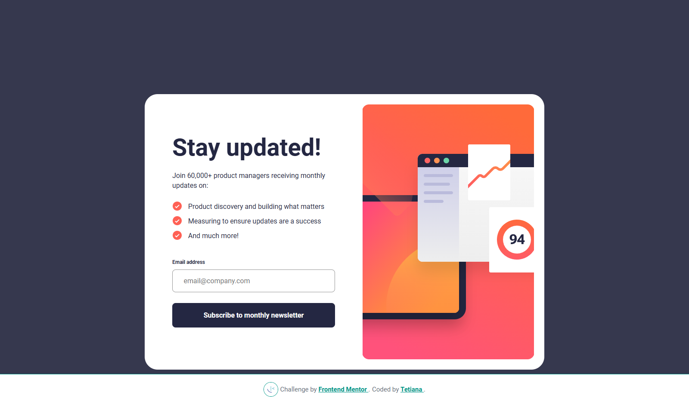

# Frontend Mentor - Newsletter Sign-up Form with Success Message

This is a solution to the [Newsletter sign-up form with success message challenge on Frontend Mentor](https://www.frontendmentor.io/challenges/newsletter-signup-form-with-success-message-3FC1AZbNrv).

## 📸 Screenshot

## 🔗 Links

- [Solution on Frontend Mentor](https://www.frontendmentor.io/solutions/responsive-newsletter-form-with-validation-and-success-message-7ym3SJcOS7)
- [Live Site on Vercel](https://fem-projects-hub.vercel.app/newsletter-sign-up)

## 🛠️ Built With

- HTML5 + Angular
- SCSS (Sass)
- TypeScript
- Reactive Forms
- Responsive Layout with Flexbox

## 📚 What I Learned

- How to use Angular's Reactive Forms for dynamic form control and validation.
- Handling validation states like `ng-touched`, `ng-invalid` and updating styles conditionally.
- DOM manipulation via Angular conditional templates (`*ngIf`) to show success messages.
- How to control focus, hover, and error states with SCSS and pseudo-classes.
- Responsive design techniques with SCSS.

## 👩‍💻 Author

- Frontend Mentor – [@TetianaAleks](https://www.frontendmentor.io/profile/TetianaAleks)
- GitHub – [@TetianaAleks](https://github.com/TetianaAleks)
- Portfolio – [https://tetiana-dev.vercel.app](https://tetiana-dev.vercel.app)

## 🙌 Acknowledgments

Thanks to the Frontend Mentor community for sharing helpful feedback and guidance!
