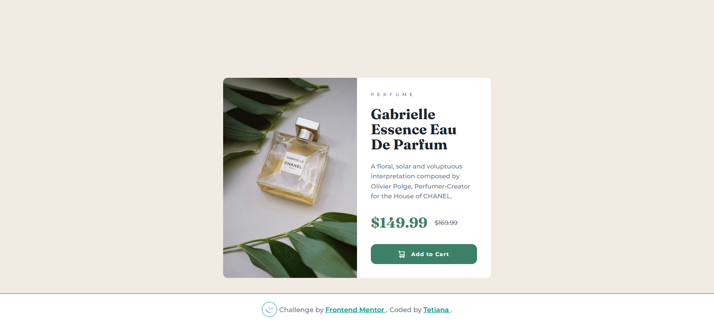

# Frontend Mentor - Product Preview Card Component Solution

This is a solution to the [Product preview card component challenge on Frontend Mentor](https://www.frontendmentor.io/challenges/product-preview-card-component-GO7UmttRfa).

## 📸 Screenshot

## 🔗 Links

- [Solution on Frontend Mentor]()
- [Live Site on Vercel](https://fem-projects-hub.vercel.app/product-preview-card)

## 🔧 Built with

- Semantic HTML5 markup
- SCSS (Sass)
- Flexbox
- Mobile-first workflow

## 💡 What I learned

- Better control of typography with SCSS variables.
- Practicing clean structuring of SCSS with nesting.

## 📈 Continued Development

- Refactor for CSS modules or utility-first approach (like Tailwind) in future.
- Add `aria-labels` or improve accessibility for button.

## 👤 Author

- Frontend Mentor – [@TetianaAleks](https://www.frontendmentor.io/profile/TetianaAleks)
- GitHub – [@TetianaAleks](https://github.com/TetianaAleks)
- Portfolio – [https://tetiana-dev.vercel.app](https://tetiana-dev.vercel.app)

## 🙏 Acknowledgments

Thanks to the Frontend Mentor community for sharing helpful feedback and guidance!
