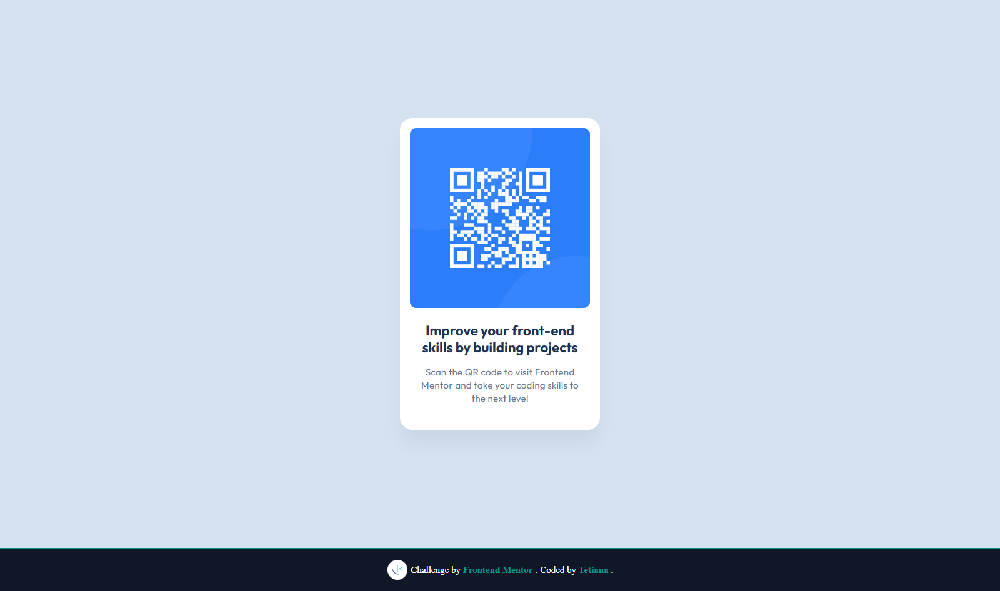

# 📦 Frontend Mentor - QR Code Component Solution

This is my solution to the [QR code component challenge on Frontend Mentor](https://www.frontendmentor.io/challenges/qr-code-component-iux_sIO_H).  
Frontend Mentor challenges help you improve your front-end skills by building real-world projects.

---

## 📸 Screenshot



---

## 🔗 Links

- [Solution on Frontend Mentor](https://www.frontendmentor.io/solutions/responsive-qr-code-component-using-html-css-and-flexbox-7O_PI0fTOw)  
- [Live Site on Vercel](https://qr-code-component-delta-seven.vercel.app/)

---

## 🚀 My Process

### Built with

- Semantic HTML5
- Modern CSS (custom properties, Flexbox)
- Mobile-first responsive layout
- Font: [Outfit](https://fonts.google.com/specimen/Outfit)
- Box shadow styling (Figma to CSS conversion)
- Git & GitHub

### What I learned

While building this component, I practiced:

- Converting Figma drop shadows to CSS `box-shadow`
- Managing mobile-first layout using Flexbox
- Applying pixel-perfect design based on Figma specs
- Using media queries for better responsiveness

```css
.card {
  box-shadow: 0 25px 25px rgba(0, 0, 0, 0.0477);
  max-width: 320px;
  border-radius: 20px;
}
```

### Continued development

In future projects, I want to:

- Improve my accessibility (WCAG) implementation
- Add light/dark theme switching
- Practice CSS Grid in layout building

---

## 👩‍💻 Author

- Website – [tetiana-dev.vercel.app](https://tetiana-dev.vercel.app)
- Frontend Mentor – [@TetianaAleks](https://www.frontendmentor.io/profile/TetianaAleks)
- GitHub – [@TetianaAleks](https://github.com/TetianaAleks)

---

## 🙌 Acknowledgments

Thanks to the Frontend Mentor team for providing high-quality starter projects.  
Special thanks to the Figma design for teaching me how to match pixel-perfect UI.