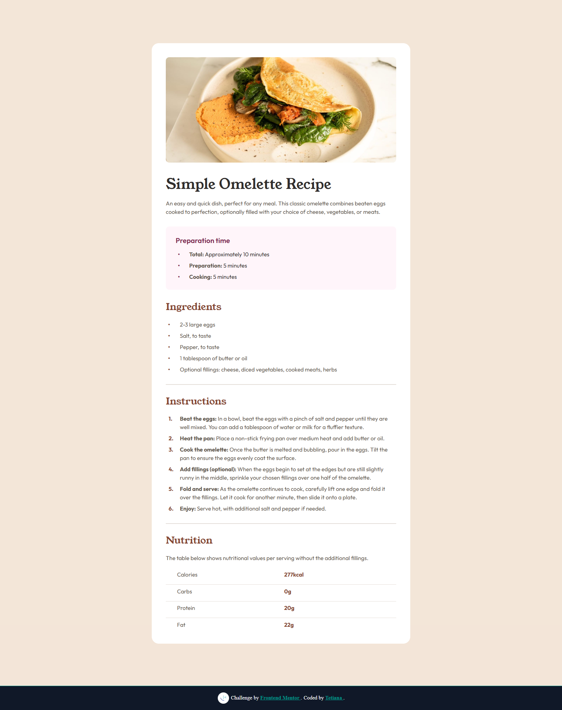

# Frontend Mentor - Recipe Page Solution

This is a solution to the [Recipe Page challenge on Frontend Mentor](https://www.frontendmentor.io/challenges/recipe-page-KiTsR8QQKm). Frontend Mentor challenges help you improve your coding skills by building realistic projects.

## 📸 Screenshot

## 🔗 Links

- [Solution on Frontend Mentor](https://www.frontendmentor.io/solutions/recipe-page-semantic-html-css-custom-properties-and-accessible-tables-xk02taac2w)  
- [Live Site on Vercel](https://recipe-page-main-sepia-seven.vercel.app/)

## 🛠️ Built With

- Semantic HTML5 markup
- Custom CSS with variables
- REM-based typography
- Mobile-first responsive layout
- Accessibility improvements

## 💡 What I Learned

- How to structure a recipe page semantically using HTML.
- Managing vertical rhythm and spacing using REM and `gap`.
- Using HTML tables for nutritional data and enhancing with CSS.
- Styling ordered and unordered lists with custom markers and counters.

## 📈 Continued Development

In the future, I’d like to:
- Add print-friendly styles
- Include a light/dark theme switch
- Build a dynamic version with ingredient adjustment based on servings

## 👤 Author

- Frontend Mentor – [@TetianaAleks](https://www.frontendmentor.io/profile/TetianaAleks)
- GitHub – [@TetianaAleks](https://github.com/TetianaAleks)
- Portfolio – [https://tetiana-dev.vercel.app](https://tetiana-dev.vercel.app)

## 🙏 Acknowledgments

Thanks to the Frontend Mentor community for sharing helpful feedback and guidance!