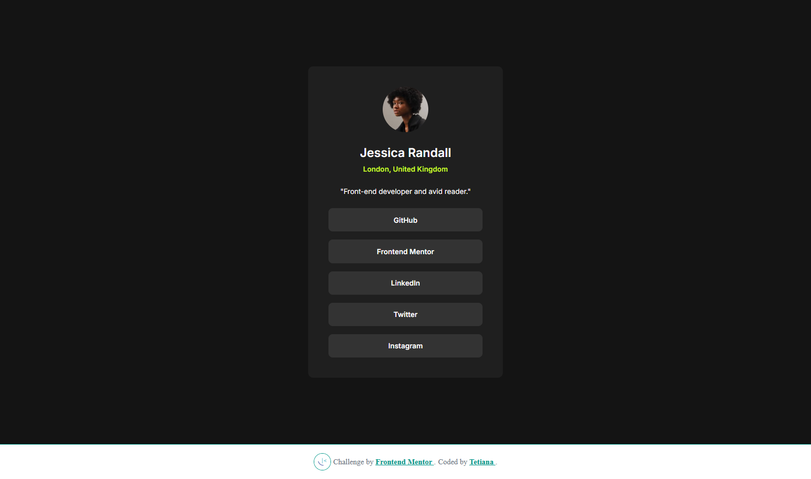

# Frontend Mentor - Social Links Profile Solution

This is a solution to the [Social Links Profile challenge on Frontend Mentor](https://www.frontendmentor.io/challenges/social-links-profile-UG32l9m6dQ). Frontend Mentor challenges help you improve your coding skills by building realistic projects.

## 🚀 Overview

### Screenshot

### Links

- Live Site URL: [Live Site on Vercel](https://social-links-profile-omega-seven.vercel.app/)
- Solution on Frontend Mentor: [Solution on Frontend Mentor](https://www.frontendmentor.io/solutions/responsive-social-links-card-with-semantic-html-rem-units-and-css-varia-Cwauw2jcPG)

## 🔧 Built With

- Semantic HTML5 markup
- Custom properties (CSS Variables)
- Flexbox
- Responsive layout with `rem` and `clamp()`
- Mobile-first workflow

## 🧠 What I Learned

- How to write clean, semantic HTML
- The power of `rem` units and `clamp()` for scalable design
- Using `:focus` states for accessibility
- Organizing variables and layout for easier maintenance

## 🚀 Continued Development

I want to explore:
- Animations/transitions on hover
- Theme switching (light/dark)
- Using JavaScript for more interaction (e.g., modal or contact form)

## 🤝 Author

- Frontend Mentor – [@TetianaAleks](https://www.frontendmentor.io/profile/TetianaAleks)
- GitHub – [@TetianaAleks](https://github.com/TetianaAleks)
- Portfolio – [tetiana-dev.vercel.app](https://tetiana-dev.vercel.app)

## 🙏 Acknowledgments

Thanks to the Frontend Mentor community for the great feedback and inspiration!