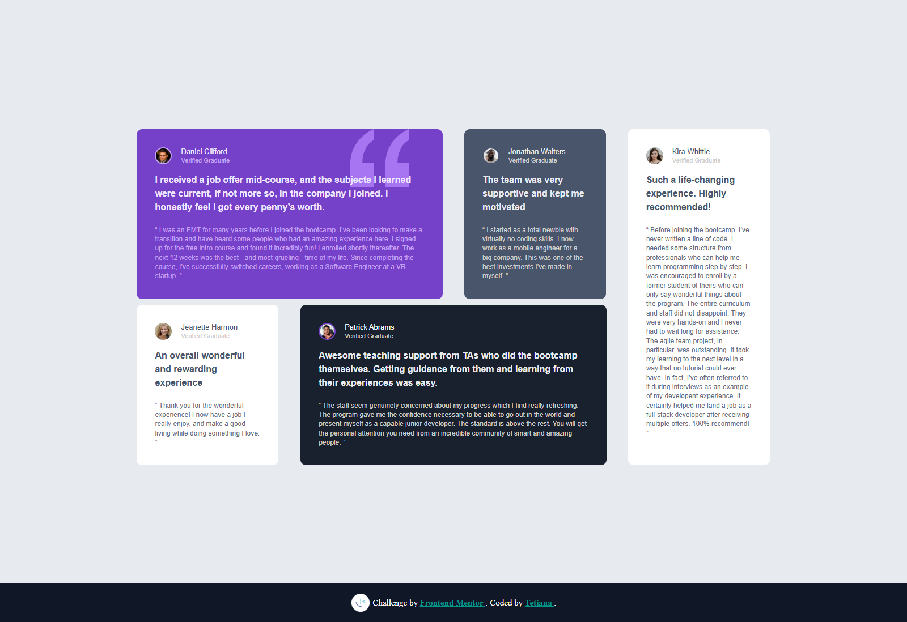

# Frontend Mentor - Testimonials Grid Section Solution

This is a solution to the [Testimonials Grid Section challenge on Frontend Mentor](https://www.frontendmentor.io/challenges/testimonials-grid-section-Nnw6J7Un7). Frontend Mentor challenges help you improve your coding skills by building realistic projects.

## 📸 Screenshot

## 🔗 Links

- [Solution on Frontend Mentor](https://www.frontendmentor.io/solutions/testimonials-grid-section-css-grid-and-bem-practice-9UcJzQRGUe)  
- [Live Site on Vercel](https://testimonials-grid-section-omega-one.vercel.app/)

## 🛠️ Built With

- Semantic HTML5 markup
- SCSS with variables and nesting
- Mobile-first responsive layout
- Flexbox-based layout
- Accessibility practices

## 💡 What I Learned

- How to organize testimonials into a responsive, asymmetric grid layout
- Managing complex spacing and consistent card styles with SCSS variables
- Handling color contrast and text hierarchy for better readability
- Reusable SCSS mixins for repeated patterns

## 📈 Continued Development

In the future, I’d like to:
- Replace Flexbox with CSS Grid for more intuitive 2D control
- Animate cards on hover for a more dynamic feel
- Explore auto-layout techniques with `grid-template-areas` for better scalability

## 👤 Author

- Frontend Mentor – [@TetianaAleks](https://www.frontendmentor.io/profile/TetianaAleks)  
- GitHub – [@TetianaAleks](https://github.com/TetianaAleks)  
- Portfolio – [https://tetiana-dev.vercel.app](https://tetiana-dev.vercel.app)

## 🙏 Acknowledgments

Thanks to the Frontend Mentor community for continuous support and detailed feedback!
